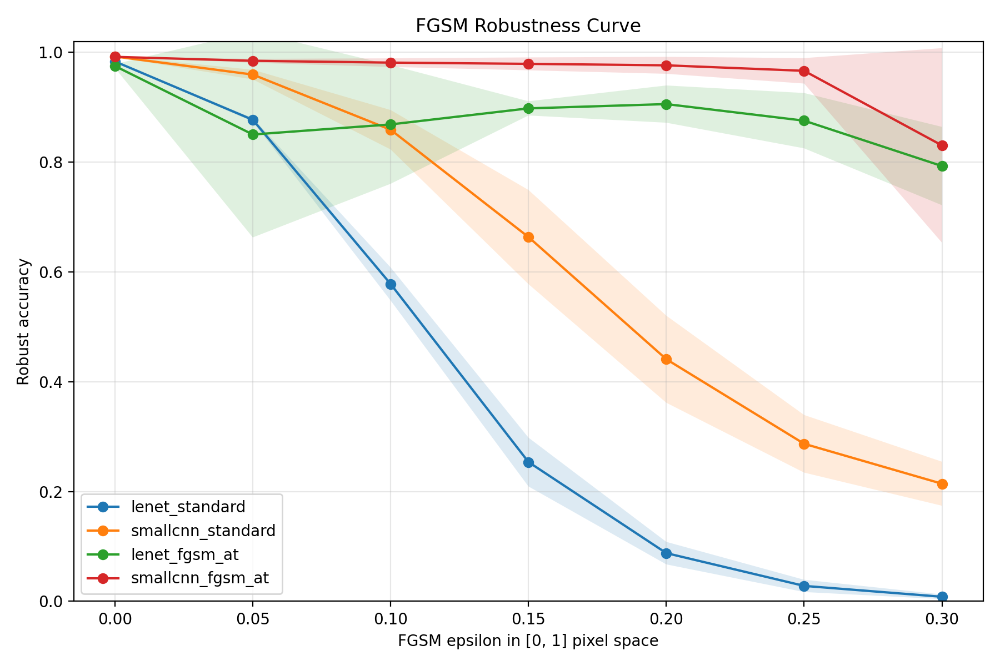
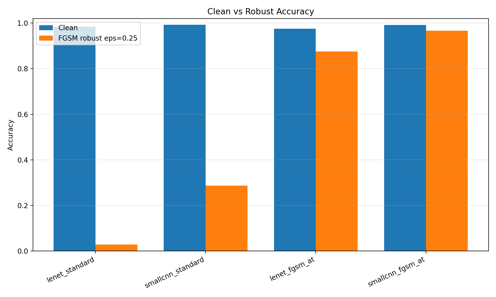
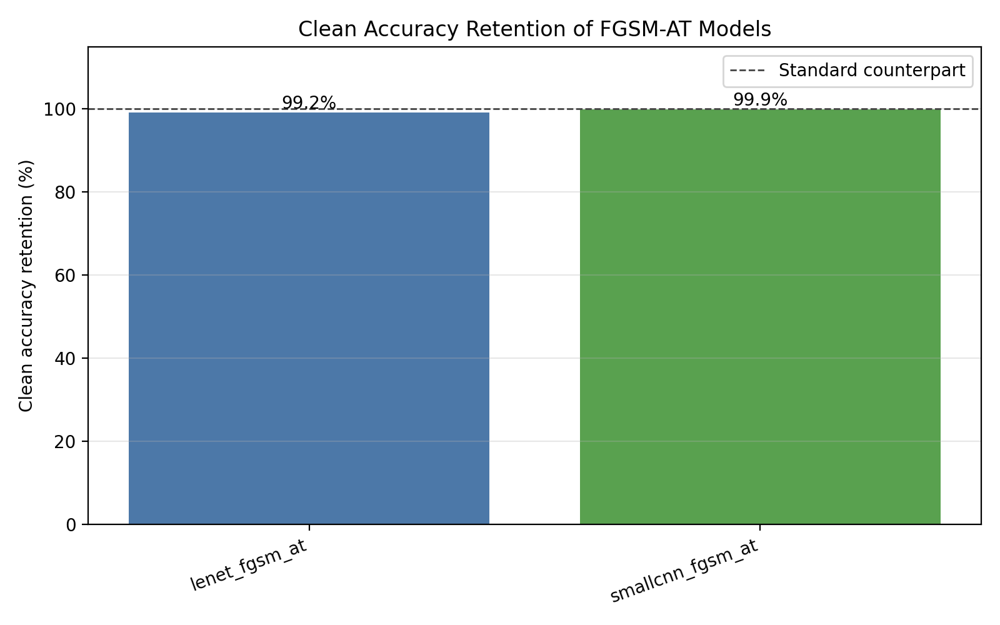
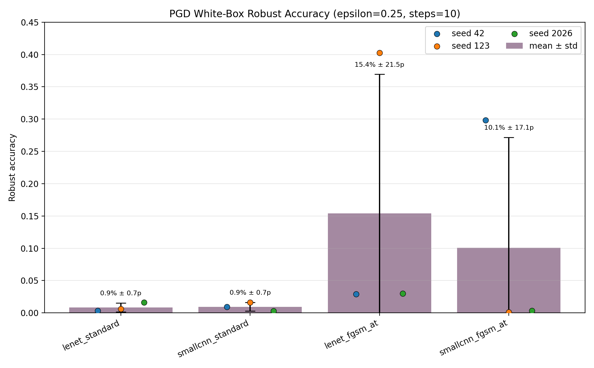
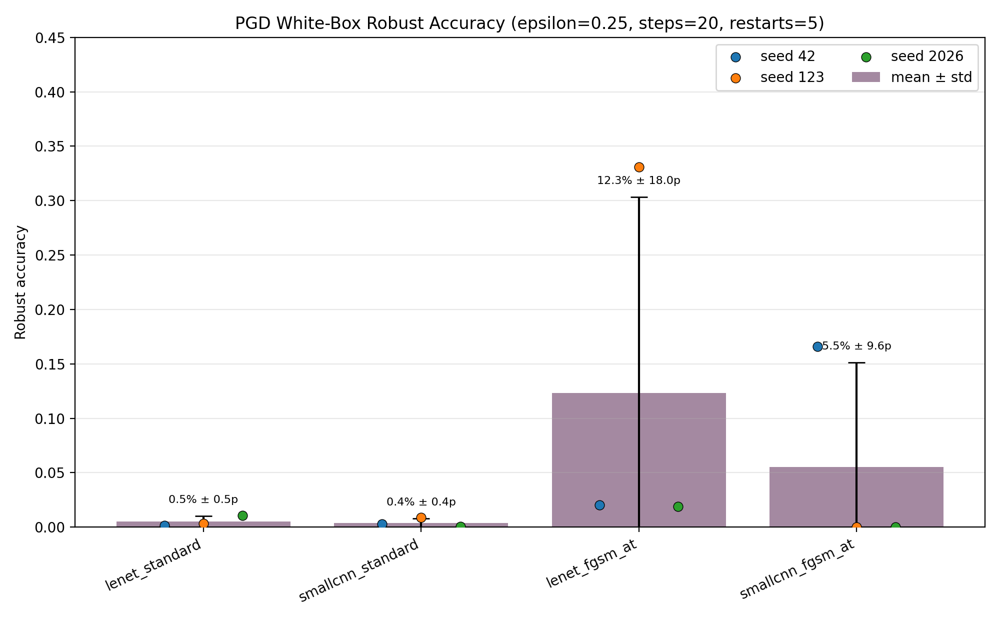
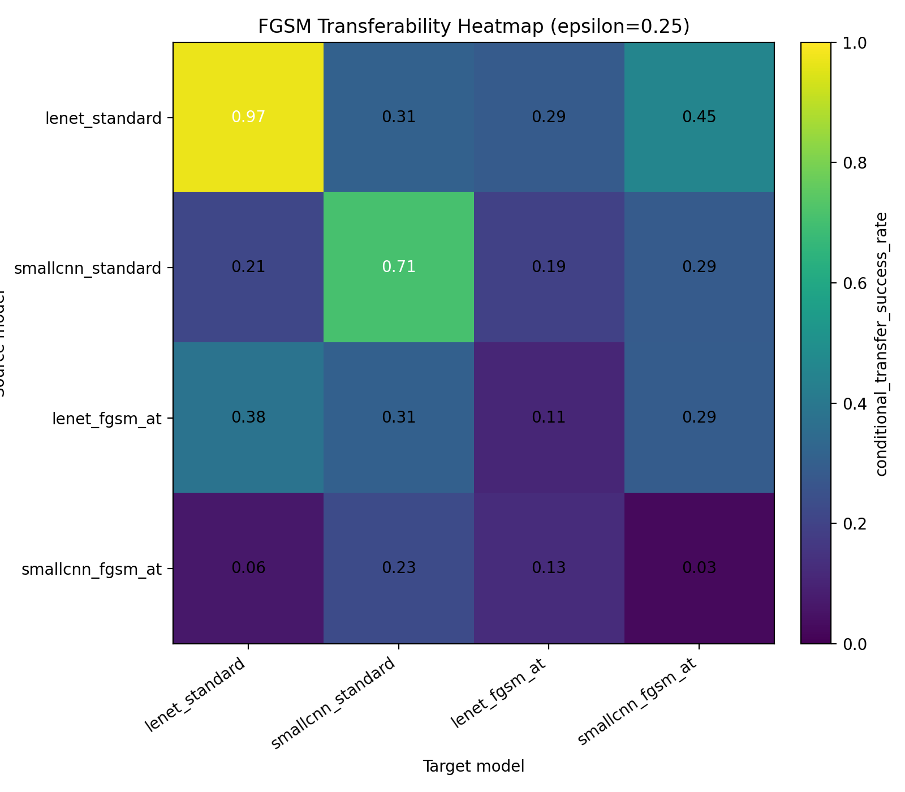
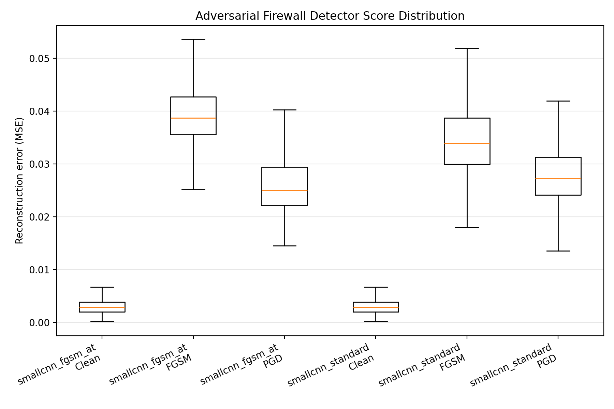
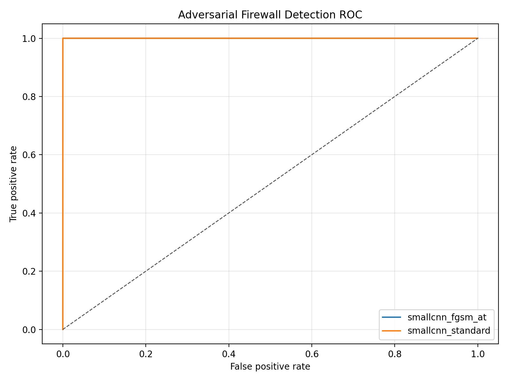
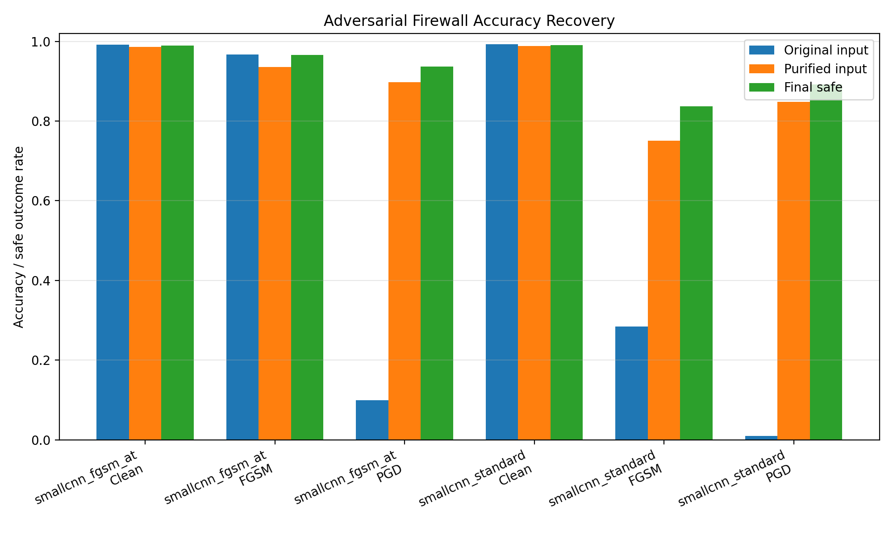
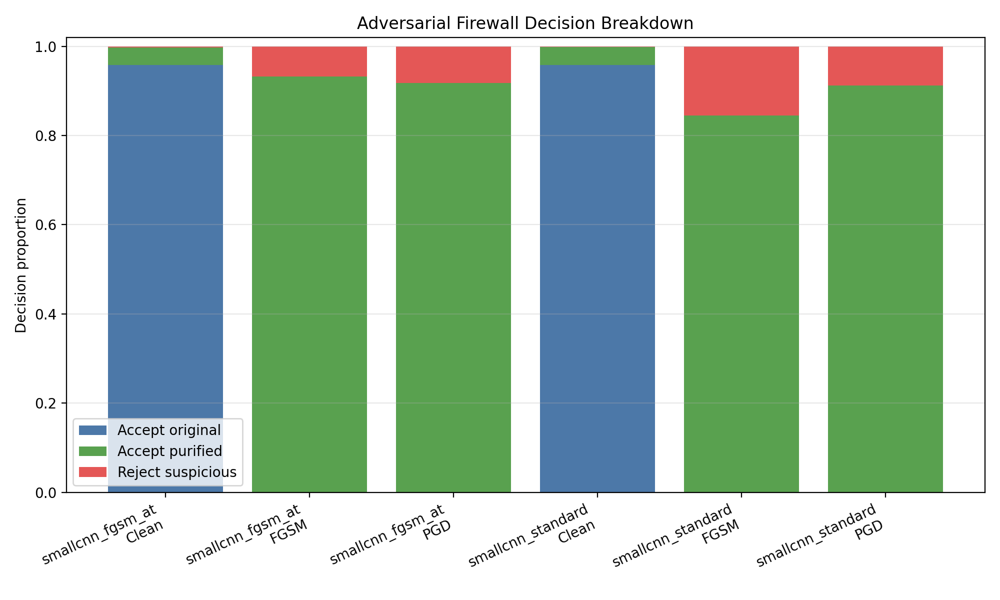

# FGSM 적대적 훈련의 강건성 일반화 한계 분석 및 Adversarial Firewall 기반 탐지·정화·거부 방어 파이프라인 구현

---

# Part 1: FGSM 적대적 훈련의 강건성 일반화 한계 분석

## 1. 연구 개요

본 연구는 MNIST 이미지 분류 모델을 대상으로 FGSM 적대적 훈련이 실제로 어느 범위까지 강건성을 제공하는지 분석한다. 단순히 FGSM 공격을 재현하는 데서 멈추지 않고, 서로 다른 두 CNN 구조와 두 가지 학습 방식을 조합하여 네 개의 모델을 학습하고 비교하였다.

비교한 모델은 다음 네 가지다.

| 모델 이름 | 구조 | 학습 방식 |
|---|---|---|
| `lenet_standard` | LeNet | 일반 학습 |
| `smallcnn_standard` | SmallCNN | 일반 학습 |
| `lenet_fgsm_at` | LeNet | FGSM 적대적 훈련 |
| `smallcnn_fgsm_at` | SmallCNN | FGSM 적대적 훈련 |

핵심 연구 질문은 다음과 같다.

> FGSM 적대적 훈련으로 향상된 강건성이 다른 구조의 모델에서 생성된 전이 공격과 더 강한 반복 공격인 PGD에도 유지되는가?

FGSM은 Goodfellow et al.이 제안한 대표적인 단일 단계 gradient 기반 공격이며, 적대적 예제가 모델 구조를 넘어 전이될 수 있다는 점은 이후 연구에서 black-box 공격 가능성과 연결되어 논의되었다[1][2]. 본 연구는 이러한 배경 위에서 FGSM 적대적 훈련 결과를 FGSM, 전이 공격, PGD 관점으로 나누어 평가한다.

## 2. 실험 설정

데이터셋은 MNIST를 사용하였다. 입력 이미지는 `[0, 1]` 픽셀 공간을 유지했으며, epsilon도 같은 공간에서 해석하였다. 기본 실험에서는 mean/std normalization을 적용하지 않았다.

### 모델 구조 비교

두 모델은 구조적으로 명확히 다르며, 이 차이가 강건성에도 영향을 미친다.

| 항목 | LeNet | SmallCNN |
|---|---|---|
| 합성곱 레이어 수 | 2 | 4 |
| 필터 수 | 6, 16 | 32, 32, 64, 64 |
| 커널 크기 | 5×5 | 3×3 |
| 풀링 방식 | AvgPool | MaxPool |
| BatchNorm | 없음 | 1, 3번째 Conv 후 적용 |
| Dropout | 없음 | 두 FC 레이어 각각 앞에 Dropout(p=0.25) 적용 |
| 파라미터 수 (추정) | 약 6만 | 약 47만 |

SmallCNN이 전반적으로 더 높은 clean 정확도와 FGSM robust 정확도를 보인 것은 이러한 구조 차이와 관련될 가능성이 있다. 필터 수가 많아 더 풍부한 특징을 학습할 수 있고, BatchNorm은 학습을 안정화하며, Dropout은 과적합을 억제한다. 다만 강건성 차이는 구조뿐 아니라 seed, 최적화 경로, 적대적 훈련 동역학의 영향을 함께 받으므로 구조 차이만으로 단정하지 않는다.

주요 실험 설정은 다음과 같다.

| 항목 | 값 |
|---|---|
| Dataset | MNIST |
| Seeds | 42, 123, 2026 |
| Epochs | 5 |
| Optimizer | Adam |
| Learning rate | 0.001 |
| FGSM 평가 epsilon | 0.00, 0.05, 0.10, 0.15, 0.20, 0.25, 0.30 |
| FGSM adversarial training epsilon | 0.25 |
| PGD 평가 | epsilon=0.25, steps=10, random start=True |
| 실행 장치 | 기본 학습/평가 및 firewall: CPU, PGD-20 restart 5 full 재평가: CUDA GTX 1660 Ti |

평가 지표는 clean accuracy, robust accuracy, clean accuracy retention, 조건부 전이 성공률을 사용하였다.

단, 코드의 `attack_success_rate`는 `1 - robust_accuracy`로 계산되며, 이는 clean 이미지부터 틀렸던 표본까지 포함하므로 엄밀한 의미의 조건부 공격 성공률이라기보다 **overall adversarial error rate**에 가깝다. 따라서 본 보고서에서는 전체 적대적 오분류율과 조건부 공격 성공률을 구분하여 표현한다.

- `overall adversarial error rate`: 전체 평가 표본 중 adversarial example에서 오분류된 비율
- `conditional attack success rate`: clean 상태에서 맞힌 표본만 분모로 두었을 때 공격으로 오분류된 비율
- `conditional transfer success rate`: source와 target이 clean 상태에서 모두 맞힌 표본만 분모로 둔 전이 공격 성공률

## 3. 핵심 결과

아래 표는 seed 42, 123, 2026 세 개의 독립 실험 평균 결과다.

| 모델 | Clean 정확도 | FGSM ε=0.25 robust 정확도 | PGD ε=0.25 robust 정확도 |
|---|---:|---:|---:|
| LeNet 일반 | 98.35% | 2.81% | 0.85% |
| SmallCNN 일반 | 99.25% | 28.70% | 0.94% |
| LeNet FGSM 훈련 | 97.52% | 87.57% | 15.39% |
| SmallCNN FGSM 훈련 | 99.19% | 96.65% | 10.07% |

FGSM 적대적 훈련은 동일한 FGSM 공격에 대해 매우 큰 방어 효과를 보였다. LeNet의 FGSM robust 정확도는 2.81%에서 87.57%로, SmallCNN은 28.70%에서 96.65%로 크게 향상되었다.

반면 clean 정확도 감소는 매우 작았다. LeNet은 98.35%에서 97.52%로 약 0.83%p, SmallCNN은 99.25%에서 99.19%로 약 0.06%p 감소하였다. 즉 본 실험에서는 정상 성능을 거의 희생하지 않으면서 동일한 FGSM 공격에 대한 강건성이 크게 향상되었다.

특히 `smallcnn_fgsm_at`은 FGSM ε=0.25 robust 정확도 96.65%를 기록하여, 군 적용 참고 자료에서 제시한 작전운용성능 참고 목표치 90%를 평균 기준으로 충족하였다[7]. 다만 이 90% 값은 공식적·보편적 기준이 아니라 참고 목표치로만 해석해야 한다.

### 원논문 재현성 비교

Goodfellow et al.[1]은 MNIST에서 maxout network를 사용하여 FGSM 적대적 훈련 전후 오류율을 보고하였다. 동일한 epsilon(ε=0.25) 조건에서 본 실험 결과와 대조하면 다음과 같다. 오류율은 `1 - robust accuracy`로 환산하였다.

| 출처 | 모델 | FGSM ε=0.25 오류율 | FGSM ε=0.25 robust 정확도 |
|---|---|---:|---:|
| Goodfellow et al. (2014) | Maxout (일반 학습) | 89.4% | 약 10.6% |
| **본 실험** | LeNet (일반 학습) | 97.19% | 2.81% |
| **본 실험** | SmallCNN (일반 학습) | 71.30% | 28.70% |
| Goodfellow et al. (2014) | Maxout (FGSM AT) | **17.9%** | 약 82.1% |
| **본 실험** | LeNet (FGSM AT) | 12.43% | **87.57%** |
| **본 실험** | SmallCNN (FGSM AT) | 3.35% | **96.65%** |

일반 학습 모델의 경우, LeNet은 원논문보다 취약하고(97.19% vs 89.4% 오류율) SmallCNN은 원논문보다 강한(71.30% vs 89.4% 오류율) 결과를 보였다. 이는 모델 구조 차이(maxout vs CNN)에 기인하는 것으로 보인다.

FGSM 적대적 훈련 후에는 두 모델 모두 원논문 결과를 상회하였다. LeNet은 오류율 12.43%(robust 정확도 87.57%), SmallCNN은 오류율 3.35%(robust 정확도 96.65%)로, 원논문의 17.9% 오류율보다 낮은 수치를 달성하였다. 다만 이 비교는 모델 구조, 학습 epoch 수, 최적화 방식이 다르므로 직접적인 우열 비교보다는 재현성 검토 수준으로 해석해야 한다.

관련 그림:

- `results/figures/robustness_curve.png` — epsilon 증가에 따른 robust accuracy 하락 곡선. AT 모델과 일반 모델 간 격차가 epsilon 0.1 이후 급격히 벌어진다. `lenet_fgsm_at`의 ε=0.05 구간 하락 후 반등(비단조)이 시각적으로 드러난다.
- `results/figures/clean_robust_comparison.png` — 모델별 clean accuracy와 FGSM ε=0.25 robust accuracy를 나란히 비교. AT 모델의 robust accuracy 향상폭과 clean accuracy 유지 수준을 한눈에 확인할 수 있다.
- `results/figures/clean_accuracy_retention.png` — AT 모델이 동일 구조의 일반 모델 대비 clean accuracy를 얼마나 유지하는지 비율로 표시. SmallCNN FGSM AT 99.94%, LeNet FGSM AT 99.16%.







## 4. 가장 중요한 발견: FGSM에만 강할 가능성

PGD 결과를 보면 FGSM 결과와 다른 양상이 나타난다. FGSM 적대적 훈련 모델은 동일한 FGSM 공격에는 높은 정확도를 보였지만, 반복 공격인 PGD에서는 강건성이 크게 떨어졌다.

방어 모델의 PGD seed별 robust 정확도는 다음과 같다.

| 모델 | Seed 42 | Seed 123 | Seed 2026 | 평균 ± 표준편차 |
|---|---:|---:|---:|---:|
| LeNet FGSM 훈련 | 2.91% | 40.26% | 3.01% | 15.39% ± 21.54%p |
| SmallCNN FGSM 훈련 | 29.81% | 0.08% | 0.31% | 10.07% ± 17.10%p |

평균값만 보면 각각 15.39%, 10.07%로 요약되지만, 실제로는 seed에 따른 편차가 매우 크다. 특히 `smallcnn_fgsm_at`은 seed 42에서 29.81%를 기록했지만, seed 123과 2026에서는 거의 0%에 가까운 PGD robust 정확도를 보였다.

이는 FGSM 적대적 훈련이 같은 단일 단계 공격에는 높은 정확도를 만들 수 있지만, 더 강한 반복적 first-order adversary인 PGD에는 안정적으로 일반화되지 않을 수 있음을 시사한다.

선행 연구에서는 이러한 현상을 FGSM adversarial training의 catastrophic overfitting 문제와 연결하여 논의한다[5]. 또한 true label을 사용해 FGSM 예제를 생성할 때 모델이 공격 패턴을 역이용하는 label leaking 현상도 보고되어 있다[3]. 본 실험 결과만으로 어느 하나라고 확정할 수는 없지만, FGSM에는 강하고 PGD에는 취약한 패턴은 두 가능성을 모두 의심하게 만든다.

관련 그림:

- `results/figures/pgd_whitebox.png` — 모델별 PGD robust accuracy 막대 그래프. 평균 막대, 표준편차 error bar, seed별 점을 함께 표시한다. AT 모델 두 개의 평균이 일반 모델보다 높아 보일 수 있지만, 표준편차(±21.54%p, ±17.10%p)가 평균보다 크다는 점에서 안정적인 강건성으로 일반화하기 어렵다.



### 추가 검증: PGD-20, restart 5회

PGD 설정이 약해서 방어 모델이 무너진 것처럼 보였을 가능성을 배제하기 위해, 전체 test set 10,000개에 대해 PGD-20과 random restart 5회를 추가로 수행하였다. 각 restart에서 생성된 adversarial example 중 target model의 loss가 가장 큰 결과를 샘플별로 선택하였다. 이 추가 검증은 seed 42, 123, 2026 전체에 대해 CUDA 환경에서 재실행하였다.

결과는 다음과 같다.

| 모델 | Seed 42 | Seed 123 | Seed 2026 | 평균 ± 표준편차 |
|---|---:|---:|---:|---:|
| LeNet 일반 | 0.14% | 0.32% | 1.08% | 0.51% ± 0.50%p |
| SmallCNN 일반 | 0.27% | 0.86% | 0.04% | 0.39% ± 0.42%p |
| LeNet FGSM 훈련 | 2.01% | 33.10% | 1.88% | 12.33% ± 17.99%p |
| SmallCNN FGSM 훈련 | 16.61% | 0.00% | 0.00% | 5.54% ± 9.59%p |

PGD-20 restart 5회에서도 FGSM 적대적 훈련 모델의 robust 정확도는 낮고 seed별 편차가 크다. 특히 `smallcnn_fgsm_at`은 seed 42에서만 16.61%를 보였고, seed 123과 2026에서는 0%였다. 이는 PGD-10 결과가 단순히 약한 공격 설정 때문에 나온 우연이라고 보기 어렵게 만든다.



## 5. FGSM 강도별 비단조 현상

일반적으로 공격 epsilon이 커질수록 robust 정확도는 낮아지는 것이 자연스럽다. 그러나 일부 방어 모델에서는 epsilon이 증가했는데도 robust 정확도가 오히려 상승하는 비단조 현상이 관찰되었다.

예를 들어 seed 42의 `lenet_fgsm_at`은 다음과 같은 결과를 보였다.

| 모델 | Seed | ε=0.05 | ε=0.20 |
|---|---:|---:|---:|
| LeNet FGSM 훈련 | 42 | 63.40% | 94.10% |

또한 seed 2026의 `smallcnn_fgsm_at`은 ε=0.20에서 99.39%를 기록했는데, 이는 해당 모델의 clean 정확도 99.22%보다도 높다.

| 모델 | Seed | ε=0.05 | ε=0.20 |
|---|---:|---:|---:|
| SmallCNN FGSM 훈련 | 2026 | 98.66% | 99.39% |

이 결과는 "공격 강도가 커질수록 더 잘 막았다"고 단순 해석해서는 안 된다. 오히려 FGSM 방향이 실제 취약 방향을 제대로 찾지 못하거나, 모델이 특정 FGSM 생성 방식에 과적합했을 가능성을 나타낸다. 이런 현상은 gradient masking 또는 obfuscated gradients가 방어 성능을 과대평가하게 만드는 상황과도 연결하여 검토할 필요가 있다[6].

## 6. 전이성 분석

ε=0.25에서 seed 42, 123, 2026 평균 조건부 전이 성공률은 다음과 같다. outgoing은 해당 모델이 공격을 생성했을 때 다른 모델로 얼마나 잘 전이되는지를 의미하고, incoming은 다른 모델이 만든 공격을 받았을 때 얼마나 취약한지를 나타낸다.

| 모델 | 공격 생성 능력 Outgoing | 공격을 받은 취약성 Incoming |
|---|---:|---:|
| LeNet 일반 | 35.16% | 21.91% |
| SmallCNN 일반 | 22.98% | 28.28% |
| LeNet FGSM 훈련 | 32.62% | 20.18% |
| SmallCNN FGSM 훈련 | 13.99% | 34.36% |

아래는 ε=0.25에서 세 seed 평균 조건부 전이 성공률 전체 행렬이다. 행은 공격 생성 모델(source), 열은 공격을 받은 모델(target)이다. 대각선은 white-box FGSM, 비대각선은 전이 공격이다.

| Source / Target | lenet_standard | smallcnn_standard | lenet_fgsm_at | smallcnn_fgsm_at |
|---|---:|---:|---:|---:|
| **lenet_standard** | **97.14%** | 31.17% | 28.85% | 45.46% |
| **smallcnn_standard** | 21.17% | **71.09%** | 19.20% | 28.57% |
| **lenet_fgsm_at** | 38.10% | 30.70% | **10.85%** | 29.06% |
| **smallcnn_fgsm_at** | 6.48% | 22.98% | 12.50% | **2.72%** |

굵은 대각선 값은 white-box FGSM 성공률이다. 일반 모델(`lenet_standard`: 97.14%, `smallcnn_standard`: 71.09%)은 자기 gradient로 만든 공격에 매우 취약하지만, AT 모델(`lenet_fgsm_at`: 10.85%, `smallcnn_fgsm_at`: 2.72%)은 white-box에도 강한 저항을 보인다.

가장 주목할 모델은 `smallcnn_fgsm_at`이다. 이 모델은 자기 자신의 FGSM 공격에 대해서는 매우 강하게 보였지만(`lenet_standard`에서 생성한 공격의 전이 성공률 45.46%), 다른 모델에서 생성된 공격에는 훨씬 취약했다.

| 항목 | 값 |
|---|---:|
| `smallcnn_fgsm_at` 자기 자신의 FGSM 공격 성공률 | 약 2.72% |
| `lenet_standard`에서 생성한 공격의 `smallcnn_fgsm_at` 전이 성공률 | 약 45.46% |
| `smallcnn_fgsm_at`의 전체 incoming transfer 평균 | 34.36% |

즉 `smallcnn_fgsm_at`은 자기 gradient로 만든 FGSM에는 거의 완벽하게 저항하지만, 다른 모델에서 생성된 공격에는 상당히 취약하다. 이는 실제 강건성이 전반적으로 높아서라기보다, 자기 모델의 gradient를 사용하는 FGSM이 취약점을 제대로 찾지 못했을 가능성을 시사한다. PGD에서 seed에 따라 거의 무너지는 결과까지 함께 고려하면, gradient masking, obfuscated gradients, 또는 공격 방식 과적합 가능성을 추가 분석해야 한다[6].

관련 그림:

- `results/figures/transferability_eps_0.25.png` — 4×4 전이성 heatmap. 색이 진할수록 전이 성공률이 높다. 대각선(white-box)에서 일반 모델 셀이 밝고 AT 모델 셀이 어두운 것, 그리고 `smallcnn_fgsm_at`의 incoming 열이 상대적으로 밝은 것을 확인할 수 있다.



## 7. Part 1 논의

초기 예상 결론은 "적대적 훈련을 적용하면 FGSM 방어 성능이 향상된다"였다. 실제 결과는 이보다 더 복잡하고 흥미롭다.

FGSM 적대적 훈련은 정상 정확도를 거의 유지하면서 동일한 FGSM 공격에 대한 강건성을 크게 향상시켰다. 그러나 PGD와 모델 간 전이 공격에서는 방어 효과가 안정적으로 일반화되지 않았다. 특히 seed에 따른 PGD 성능 편차와 epsilon별 비단조 robust 정확도는 단일 FGSM 공격에 대한 높은 정확도만으로 일반적인 적대적 강건성을 판단하기 어렵다는 점을 보여준다.

따라서 Part 1의 핵심 결론은 다음과 같다.

> FGSM 적대적 훈련은 정상 정확도를 거의 유지하면서 동일한 FGSM 공격에 대한 강건성을 크게 향상시켰다. 그러나 PGD와 모델 간 전이 공격에서는 방어 효과가 안정적으로 일반화되지 않았으며, 모델 구조와 초기 seed에 따라 성능 편차가 크게 나타났다. 따라서 단일 FGSM 공격에 대한 높은 정확도만으로 일반적인 적대적 강건성을 판단하기 어렵다.

---

# Part 2: Adversarial Firewall 기반 탐지·정화·거부 방어 파이프라인

## 8. 확장 배경 및 동기

Part 1의 실험 결과, FGSM 적대적 훈련은 FGSM 공격에는 효과적이지만 PGD와 전이 공격에서는 안정적으로 일반화되지 않음을 확인하였다. 이러한 한계는 모델 자체의 강건성을 높이는 방식만으로는 충분하지 않을 수 있음을 시사한다.

이에 Part 2에서는 모델을 더 강건하게 학습시키는 접근에서 한 걸음 나아가, **입력 단계에서 적대적 입력을 탐지하고 정화하며, 위험도가 높은 경우 판단 자체를 거부하는 시스템 수준 방어 파이프라인**을 추가로 구현하였다. 이 확장은 새로운 방어 알고리즘을 제안하는 것이 아니라, 기존 실험 결과에서 드러난 한계를 바탕으로 실용적인 입력 단계 방어 절차의 가능성을 검증하는 것을 목적으로 한다.

군 AI 적용 맥락에서, 모든 입력을 무조건 자동 분류하는 것보다 위험 입력을 탐지하고 정화하거나 인간 검토로 넘기는 reject option은 실용적인 방어 절차로 해석될 수 있다[7].

## 9. Adversarial Firewall 구조

Adversarial Firewall은 세 가지 핵심 컴포넌트로 구성된다.

### 9.1 Autoencoder Purifier

Convolutional autoencoder는 clean MNIST 이미지로 사전 학습되어 입력 이미지를 복원한다. 인코더는 입력을 저차원 잠재 표현으로 압축하고, 디코더는 이를 원본 공간으로 복원한다. 이 과정에서 고주파 적대적 노이즈는 감쇠되는 경향이 있다.

학습 설정: clean MNIST 학습 데이터, 5 epoch, Adam optimizer, learning rate 0.001.

### 9.2 Reconstruction Error Detector

입력 이미지 $x$에 대해 autoencoder $AE$의 재구성 오차(reconstruction error)를 다음과 같이 계산한다.

$$r(x) = \text{MSE}(x, AE(x)) = \frac{1}{d} \sum_{i=1}^{d} (x_i - AE(x)_i)^2$$

clean 이미지는 autoencoder가 잘 복원하므로 재구성 오차가 낮고, 적대적 입력은 노이즈로 인해 오차가 높게 나타나는 경향이 있다. 탐지 임계값은 clean 검증 데이터의 재구성 오차 95번째 백분위수로 설정하여 clean 입력에 대한 오탐률(FPR)을 약 5%로 제한한다.

### 9.3 Reject Option Policy

탐지 결과와 정화 후 분류기의 신뢰도를 조합하여 다음 세 가지 판정 중 하나를 출력한다.

| 판정 | 조건 | 처리 |
|---|---|---|
| `ACCEPT_ORIGINAL` | 재구성 오차 < 임계값 | 원본 입력을 분류기에 전달 |
| `ACCEPT_PURIFIED` | 재구성 오차 ≥ 임계값 이고 정화 후 신뢰도 ≥ 기준값 | 정화된 이미지를 분류기에 전달 |
| `REJECT_SUSPICIOUS` | 재구성 오차 ≥ 임계값 이고 정화 후 신뢰도 < 기준값 | 판단 거부, 인간 검토 요청 |

Final safe accuracy는 정확히 수락된 예측의 정확도를 계산하되, 적대적 입력에 대해 거부(REJECT_SUSPICIOUS) 처리된 경우도 안전한 결과로 간주하여 포함한다. 자율 오분류를 방지했기 때문이다.

전체 방어 파이프라인의 흐름은 다음과 같다.

```
입력 이미지
    │
    ├─ Autoencoder 복원 → 재구성 오차 계산
    │
    ├─ 오차 < 임계값 → ACCEPT_ORIGINAL → 분류기 → 결과 출력
    │
    ├─ 오차 ≥ 임계값, 신뢰도 ≥ 기준 → ACCEPT_PURIFIED → 분류기 → 결과 출력
    │
    └─ 오차 ≥ 임계값, 신뢰도 < 기준 → REJECT_SUSPICIOUS → 인간 검토
```

## 10. Adversarial Firewall 실험 결과

### 주의 사항

아래 모든 결과는 **seed 42, 123, 2026 세 개 실험 평균, 각 seed별 전체 테스트 10,000개** 기준이다. Part 1의 FGSM/PGD/전이성 분석과 동일하게 여러 seed 평균으로 해석할 수 있도록 Adversarial Firewall도 3-seed full test로 재평가하였다.

평가 대상 모델은 `smallcnn_standard`와 `smallcnn_fgsm_at`이며, 평가 조건은 Clean, FGSM ε=0.25, PGD ε=0.25이다.

### 10.1 탐지 성능

| 모델 | 공격 조건 | AUC | TPR@FPR 5% |
|---|---|---:|---:|
| SmallCNN 일반 | FGSM | 1.000 | 100.00% |
| SmallCNN 일반 | PGD | 1.000 | 100.00% |
| SmallCNN 일반 | 전체 공격 | 1.000 | 100.00% |
| SmallCNN FGSM 훈련 | FGSM | 1.000 | 100.00% |
| SmallCNN FGSM 훈련 | PGD | 1.000 | 100.00% |
| SmallCNN FGSM 훈련 | 전체 공격 | 1.000 | 100.00% |

본 실험의 MNIST 및 ε=0.25 non-adaptive FGSM/PGD 조건에서는 clean 입력과 공격 입력의 reconstruction error 분포가 거의 완전히 분리되어 AUC 1.0, FPR 5% 기준 TPR 100% 수준의 탐지 성능을 보였다. 다만 이는 adaptive attack에 대한 보장을 의미하지 않으며, 공격자가 autoencoder와 detector 구조를 알고 reconstruction error를 함께 최소화하도록 공격을 최적화할 경우 우회될 수 있다.

### 10.2 정화 및 거부 결과

| 모델 | 조건 | 방화벽 전 정확도 | 정화 후 정확도 | 수락된 표본 정확도 | 탐지율 | 거부율 | 최종 안전 정확도 |
|---|---|---:|---:|---:|---:|---:|---:|
| SmallCNN 일반 | Clean | 99.25% | 98.77% | 99.22% | 4.17% | 0.14% | 99.07% |
| SmallCNN 일반 | FGSM | 28.47% | 75.11% | 80.46% | 100.00% | 15.47% | 83.73% |
| SmallCNN 일반 | PGD | 0.99% | 84.84% | 87.98% | 100.00% | 8.74% | 89.15% |
| SmallCNN FGSM 훈련 | Clean | 99.19% | 98.58% | 99.15% | 4.17% | 0.25% | 98.90% |
| SmallCNN FGSM 훈련 | FGSM | 96.65% | 93.61% | 96.33% | 100.00% | 6.76% | 96.58% |
| SmallCNN FGSM 훈련 | PGD | 10.00% | 89.72% | 92.85% | 100.00% | 8.29% | 93.62% |

주요 결과를 정리하면 다음과 같다.

- `smallcnn_fgsm_at` 기준 PGD 공격 시, 방화벽 적용 전 정확도 10.00%에서 최종 안전 정확도 **93.62%**로 회복되었다.
- `smallcnn_standard` 기준 FGSM 공격 시, 28.47%에서 **83.73%**로 회복되었다.
- `smallcnn_standard` 기준 PGD 공격 시, 0.99%에서 **89.15%**로 회복되었다.
- Clean 입력에 대한 오탐(FP)으로 인한 최종 안전 정확도 감소는 두 모델 모두 1% 미만 수준으로 유지되었다.

관련 그림:

- `results/figures/firewall_score_distribution.png` — Clean/FGSM/PGD 입력의 재구성 오차 분포. 적대적 입력의 오차가 clean 입력보다 뚜렷이 높아 탐지 가능성이 확인된다.
- `results/figures/firewall_detection_roc_curve.png` — 재구성 오차 기반 탐지 ROC 곡선. 본 MNIST 및 non-adaptive FGSM/PGD 조건에서 두 모델 모두 AUC 1.0 수준을 보인다.
- `results/figures/firewall_accuracy_recovery.png` — 방화벽 적용 전, 정화 후, 최종 안전 정확도 비교. 정화와 거부 정책이 정확도 회복에 기여하는 양을 모델·조건별로 확인할 수 있다.
- `results/figures/firewall_decision_breakdown.png` — 원본 통과, 정화 후 통과, 거부 비율. Clean 입력에서 거부율이 낮고, 공격 입력에서 탐지율이 높은 것을 확인할 수 있다.
- `results/figures/original_attacked_purified_examples.png` — 원본 이미지, 적대적 입력, autoencoder 정화 이미지 비교. 정화 전후 시각적 차이를 직관적으로 보여준다.









## 11. Adversarial Firewall 한계 및 논의

### 11.1 Adaptive Attack에 대한 한계

본 방화벽의 가장 중요한 한계는 **adaptive attack**에 대한 보장을 제공하지 못한다는 점이다. Adaptive attack이란 공격자가 방어 시스템의 구조(autoencoder, detector)를 알고 이를 우회하도록 공격을 최적화하는 방식이다.

재구성 오차 기반 탐지는 autoencoder와 분류기를 함께 고려하여 재구성 오차를 최소화하도록 설계된 공격에 의해 우회될 수 있다. 즉 공격자가 탐지 임계값 이하의 재구성 오차를 유지하면서 분류기를 오분류하는 적대적 예제를 생성할 수 있다면, 본 방화벽은 해당 공격을 탐지하지 못한다. 이러한 adaptive attack의 가능성은 Athalye et al.[6]이 제기한 방어 메커니즘 우회 논의와 동일한 맥락에 있다.

따라서 본 결과는 재구성 오차 기반 탐지의 가능성을 보여주는 프로토타입 검증으로 해석해야 하며, 적대적 환경에서의 완전한 보안 해법으로 해석해서는 안 된다.

### 11.2 실험 범위 한계

- 방화벽 결과는 3개 seed 평균이지만, 여전히 MNIST와 두 SmallCNN 계열 모델에 한정된다.
- 평가 대상 모델을 `smallcnn_standard`와 `smallcnn_fgsm_at`으로 제한하였으며, LeNet 계열 모델에 대한 방화벽 성능은 평가하지 않았다.
- MNIST 데이터셋 기반 결과이므로, 실제 군사 영상 등 고해상도 복잡한 도메인에 직접 적용하기 어렵다.
- Transfer attack(다른 모델에서 생성된 공격)에 대한 방화벽 성능은 별도로 평가하지 않았다.

---

# 전체 결론

## 12. 개발 과정 및 개선 히스토리

본 프로젝트는 단일 실험으로 완결된 것이 아니라, 결과를 분석하고 문제를 발견하며 보완을 반복하는 방식으로 진행되었다. 아래는 단계별 개발 흐름이다.

### 1단계 — 기준 모델 수립

LeNet과 SmallCNN을 일반 학습으로 훈련하여 기준 성능을 측정하였다. FGSM ε=0.25 공격에서 두 모델 모두 거의 완전히 무너졌다(LeNet 2.81%, SmallCNN 28.70%). 이는 일반 학습만으로는 적대적 공격에 취약하다는 Goodfellow et al.의 관찰을 재확인한 것이다.

### 2단계 — FGSM 적대적 훈련 적용

동일한 모델에 FGSM AT(clean 50% + FGSM 50% 혼합 학습)를 적용하였다. FGSM robust 정확도가 LeNet 87.57%, SmallCNN 96.65%로 크게 향상되었으며, clean 정확도 감소는 각각 0.83%p, 0.06%p에 불과하였다. 원논문 결과(오류율 17.9%)를 상회하는 재현성을 확인하였다.

**→ 문제 없음. 그러나 여기서 멈추지 않고 더 강한 공격으로 검증하기로 결정.**

### 3단계 — 문제 발견: PGD 취약성

PGD ε=0.25로 평가하자 FGSM AT 모델이 크게 무너졌다(LeNet AT 15.39%, SmallCNN AT 10.07%). 더 심각한 것은 seed에 따른 편차가 극단적이었다는 점이다. `smallcnn_fgsm_at`은 seed 42에서 29.81%를 보였지만 seed 123과 2026에서는 거의 0%였다.

**→ 핵심 문제 확인: FGSM AT가 PGD에 일반화되지 않는다(catastrophic overfitting 의심).**

### 4단계 — 보완 1: PGD 평가 강화

"PGD 설정이 약했기 때문에 나온 결과가 아닌가"라는 반론을 검토하기 위해 PGD-20, random restart 5회로 full test 10,000개 추가 검증을 수행하였다. 결과는 PGD-10과 동일하게 낮고 seed별 편차가 컸다(SmallCNN AT: 5.54% ± 9.59%p). 이로써 PGD 설정이 약해서 나온 우연이라는 반론은 상당 부분 배제되었다.

**→ PGD 취약성이 실험 설정 문제가 아닌 FGSM AT의 구조적 한계임을 확인.**

### 5단계 — 보완 2: 시각화 개선

초기 PGD 그래프는 모델별 평균 막대만 표시하여 seed별 불안정성이 드러나지 않았다. 이를 평균 막대 + 표준편차 error bar + seed 42·123·2026 개별 점이 함께 표시되도록 갱신하였다. 표준편차가 평균보다 크거나 맞먹는다는 사실이 시각적으로 명확해졌다.

**→ 데이터 해석의 정직성 강화.**

### 6단계 — 시스템 수준 확장: Adversarial Firewall

FGSM AT의 PGD 취약성을 모델 수준에서 해결하는 것에 한계가 있다고 판단하여, 입력 단계에서 적대적 입력을 탐지하고 정화하는 Adversarial Firewall을 구현하였다. Convolutional autoencoder 기반 재구성 오차 탐지와 reject option을 도입한 결과, 3-seed 평균에서 `smallcnn_fgsm_at` 기준 PGD 공격 시 10.00%에서 최종 안전 정확도 93.62%로 회복되었다.

**→ 방어 파이프라인을 모델 수준에서 시스템 수준으로 확장.**

### 단계별 성능 변화 요약

1~4단계의 수치는 공격 이미지에 대한 robust accuracy이고, 6단계의 수치는 Firewall의 final safe accuracy이다. 6단계는 거부된 적대적 입력을 안전한 결과로 계산하므로 앞 단계의 robust accuracy와 같은 지표는 아니며, 시스템 수준 방어 효과를 보기 위한 별도 지표다.

| 단계 | 핵심 변화 | FGSM 관련 지표 | PGD 관련 지표 |
|---|---|---:|---:|
| 1단계 | 일반 학습 (SmallCNN 기준) | 28.70% | 0.94% |
| 2단계 | FGSM AT 적용 | **96.65%** ↑ | 10.07% |
| 3단계 | 문제 발견 | 96.65% | **10.07%** (불안정) |
| 4단계 | PGD 강화 검증 | 96.65% | 5.54% (PGD-20 restart 5 full-test 기준) |
| 6단계 | Firewall 추가 (3-seed full, final safe accuracy) | 96.58% | **93.62%** ↑ |

## 13. 결론

본 프로젝트는 두 단계로 구성된다. Part 1에서는 FGSM 적대적 훈련의 강건성 일반화 한계를 분석하였고, Part 2에서는 이 한계를 극복하기 위한 입력 단계 방어 파이프라인을 구현하였다.

Part 1의 핵심 발견은 다음과 같다.

> FGSM 적대적 훈련은 동일한 FGSM 공격에 대해서는 매우 효과적이지만, PGD와 모델 간 전이 공격에서는 안정적으로 일반화되지 않는다. 특히 seed에 따른 PGD robust 정확도의 극단적인 편차와 epsilon별 비단조 현상은 FGSM 방어가 특정 공격 방식에 과적합했을 가능성을 보여주며, gradient masking 또는 catastrophic overfitting과 연관된 현상으로 해석된다.

Part 2의 핵심 발견은 다음과 같다.

> Convolutional autoencoder 기반 재구성 오차 탐지는 3-seed full test의 MNIST 및 non-adaptive FGSM/PGD 조건에서 clean 입력과 공격 입력을 AUC 1.0 수준으로 구분했으며, 정화와 거부 정책을 통해 공격 상황에서의 최종 안전 정확도를 크게 회복하였다. 다만 adaptive attack에 대한 보장은 제공하지 않는다.

두 결과를 종합하면, 단일 방어 전략만으로는 다양한 공격 시나리오에 대응하기 어려우며, 모델 수준 방어와 입력 단계 방어를 결합한 다층 방어 구조가 보다 현실적인 접근임을 보여준다.

## 14. 추가 검증 및 향후 보완

### 14.1 PGD 그래프 보완

PGD 그래프는 모델별 평균 막대만으로는 seed별 불안정성을 충분히 드러내기 어렵다. 이에 `results/figures/pgd_whitebox.png`를 평균 막대, 표준편차 error bar, seed 42·123·2026 개별 점이 함께 표시되도록 갱신하였다. 이 수정으로 FGSM-AT 모델의 PGD 평균 robust 정확도가 일반 모델보다 높아 보이지만, 표준편차(±21.54%p, ±17.10%p)가 평균보다 크거나 맞먹는다는 점이 더 명확하게 드러난다.

### 14.2 향후 연구 방향

- Adaptive attack에 대한 방화벽 강건성 평가
- LeNet 계열 모델에 대한 방화벽 확장 적용
- Feature squeezing, prediction disagreement 등 다중 탐지기 앙상블 비교
- 실제 군사 영상 데이터셋 또는 유사 도메인으로의 전이 검증

## 15. 산출물 위치

주요 산출물은 다음 경로에 저장되어 있다.

**Part 1 산출물**

| 항목 | 경로 |
|---|---|
| 자동 요약 보고서 | `results/summary.md` |
| 원본 CSV | `results/raw/` |
| 평균/표준편차 집계 CSV | `results/aggregated/` |
| 그래프 | `results/figures/` |
| 그림 인덱스 | `results/figures/figure_index.md` |
| 모델 checkpoint | `checkpoints/` |
| PGD-20 restart 5 실행 환경 | `results/pgd20_restart5_environment.json` |

**Part 2 산출물**

| 항목 | 경로 |
|---|---|
| 방화벽 평가 결과 (샘플별) | `results/raw/firewall_detection_scores.csv` |
| 방화벽 평가 결과 (조건별) | `results/raw/firewall_results.csv` |
| 방화벽 탐지 성능 집계 | `results/aggregated/firewall_detection_summary.csv` |
| 방화벽 결과 집계 | `results/aggregated/firewall_results_summary.csv` |
| Autoencoder purifier checkpoint | `checkpoints/autoencoder_seed42.pt`, `checkpoints/autoencoder_seed123.pt`, `checkpoints/autoencoder_seed2026.pt` |
| 발표용 시각 보고서 (HTML) | `results/visual_report/index.html` |
| 인터랙티브 방어 시뮬레이션 (HTML) | `results/simulation/index.html` |

## 참고문헌

[1] Ian J. Goodfellow, Jonathon Shlens, Christian Szegedy, "Explaining and Harnessing Adversarial Examples," arXiv:1412.6572, 2014. <https://arxiv.org/abs/1412.6572>

[2] Nicolas Papernot, Patrick McDaniel, Ian Goodfellow, "Transferability in Machine Learning: from Phenomena to Black-Box Attacks using Adversarial Samples," arXiv:1605.07277, 2016. <https://arxiv.org/abs/1605.07277>

[3] Alexey Kurakin, Ian Goodfellow, Samy Bengio, "Adversarial Machine Learning at Scale," arXiv:1611.01236, 2016. <https://arxiv.org/abs/1611.01236>

[4] Aleksander Madry, Aleksandar Makelov, Ludwig Schmidt, Dimitris Tsipras, Adrian Vladu, "Towards Deep Learning Models Resistant to Adversarial Attacks," arXiv:1706.06083, 2017. <https://arxiv.org/abs/1706.06083>

[5] Eric Wong, Leslie Rice, J. Zico Kolter, "Fast is better than free: Revisiting adversarial training," arXiv:2001.03994, 2020. <https://arxiv.org/abs/2001.03994>

[6] Anish Athalye, Nicholas Carlini, David Wagner, "Obfuscated Gradients Give a False Sense of Security: Circumventing Defenses to Adversarial Examples," arXiv:1802.00420, 2018. <https://arxiv.org/abs/1802.00420>

[7] 이승민, 「인공지능(AI) 적대적 공격 및 적대적 공격에 대한 방어 기술 동향과 군 적용 발전방안」, 국방논단.
